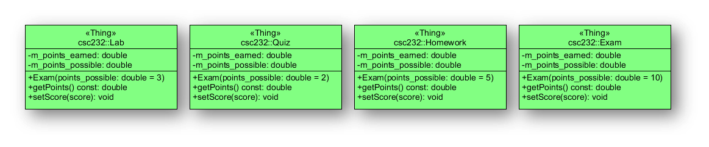

# Homework 1: Basic Domain Objects

We begin the development of the Grade Management System by first modeling some very basic domain objects. Let's consider this course itself: CSC232. What objects contribute to your final grade? We have four "things":

1. Labs
1. Quizzes
1. Homework
1. Exams

In this assignment, you'll model these with the following, simple (naive) design:

## To Do

1. Clone your GMS project repo. _Each member of the team must clone the repository and do some subset of the following tasks_.
1. Create a `develop` branch within which to do this work.
1. Pick someone on the team to update the `README.md` file. Add the following details to the file:
   1. Create a table lists each team member and any contact information you want revealed on this page, e.g., phone number, email, etc. Keep in mind that the repo is private so this information will only be visible to your teammates.
   1. Create a revision table that highlights the major changes that (will) occur with each homework assignment. Be creative/imaginative with how you want to present this information.
1. Implement these four domain classes using separate specification (header) and implementation files.
1. In addition to these classes, a `main.cpp` (or some equivalent) is to be created that demonstrates the use of these classes.
1. Add a `CMakeLists.txt` file to the repository and define at least one target that includes `main.cpp`, `lab.h`, `lab.cpp`, `quiz.h`, `quiz.cpp`, `hw.h`, `hw.cpp`, `exam.h` and `exam.cpp`.
1. When you have completed these coding tasks, create a pull request that request you merge the `develop` branch _into_ your `master` branch.
   1. Be sure to add `professordaehn`, `radeeb` and `thydnguyen` as reviewers to the pull request.
   1. Choose a "team leader" and assign him/her as the "assignee" to the pull request.

## Due Date

This assignment is due by **23:59:59 Mon 10 September 2018**. That is, the pull request must be created by that time. Any modifications to the pull request after this time will not be considered for evaluation.

## Grading Rubric

This assignment is worth five (5) points. These points are accumulated as follows:

|Points|Criteria|
|------|--------|
|1     |Pull request created by the due date?|
|1     |Code style -- was a consistent coding style employed?|
|1     |Program correctness -- Did the team properly model the assigned classes?|
|1     |Executable -- Did the team create a usable target with all files included?|
|1     |Collaboration -- Did everyone on the team contribute to the pull request?|

**Note**:

* Concerning the _Pull request_ criterion; in addition to meeting the deadline, you're being assessed on whether you added all the required reviewers.
* Concerning the _Code style_ criterion; it doesn't matter what code style you use, but the entire team must adopt that style. You're being assessed across the entire project, not just consistency within one file.
* Concerning the _Collaboration_ criterion; this also encompasses whether the team delivered all the expected deliverables.

For this assignment, the following files are minimally required:

1. An update to the `README.md`
1. Lab class: `lab.h` and `lab.cpp`
1. Quiz class: `quiz.h` and `quiz.cpp`
1. Homework class: `hw.h` and `hw.cpp`
1. Exam class: `exam.h` and `exam.cpp`